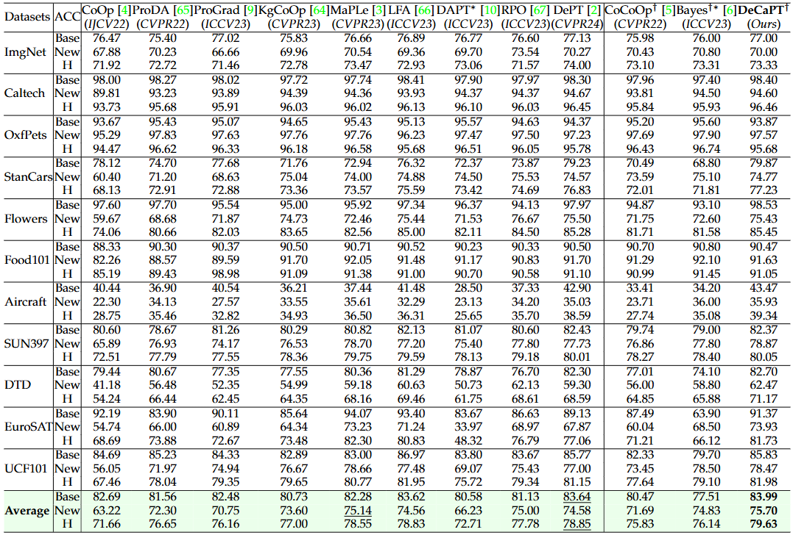

# A Closer Look at Conditional Prompt Tuning for Vision-Language Models

Offical implementation of the paper [A Closer Look at Conditional Prompt Tuning for Vision-Language Models](https://arxiv.org/abs/2506.23856).

**Note:** We are doing our best to improve this work. If you have any questions or suggestions, please feel free to create an issue in this repo or contact us at jizhang.jim@gmail.com.

----

# News

- (Mar. 20, 2025)
  
  - Training and evaluation codes for CaPT are released.

----

# Highlights

> **Abstract** Prompt tuning has demonstrated remarkable success in adapting large Vision-Language pretrained Models (VLPMs) to a variety of downstream tasks. Despite the great promise, existing prompt learning methods often struggle to overcome the Base-New Tradeoff (BNT) problem, i.e. as VLPMs are better tuned to a base (or target) task, their ability to generalize to new tasks diminishes. Recent work on conditional prompt learning addresses this problem by replacing static prompts with dynamic Visual Image Information (VII)-conditioned prompts, improving the model’s generalization to new tasks to some extent. In this work, we identify a critical issue with existing conditional prompt tuning approaches: the performance gains on new tasks do not benefit from the VII injected into the prompt. In fact, even a random noise-conditioned prompt can outperform the VII-conditioned counterpart. On further analysis, we find that learning dynamic prompts conditioned on Textual Class Information (TCI) is the key to solving the BNT problem in prompt tuning. Motivated by this, we propose Class-adaptive Prompt Tuning (CaPT), which enables fast adaptation of tuned models to new classes by learning TCI-conditioned prompts from the base task classes. Notably, our CaPT is orthogonal to existing unconditional prompt tuning approaches and can be used as a plugin to enhance them with negligible additional computational cost. Extensive experiments on several datasets show the strong flexibility and effectiveness of CaPT. CaPT consistently improves the performance of a broad spectrum of prompt tuning methods across base-to-new generalization, cross-dataset generalization and cross-domain generalization settings.


<div align="center">
  
  
</div>

----

# Main Contributions

> 1. For the first time, we reveal that learning dynamic prompts conditioned on textual class information (TCI), rather than visual image information (VII), is crucial for circumventing the Base-New Tradeoff (BNT) problem in prompt tuning.
> 2. We propose CaPT, the first TCI-conditioned prompt tuning framework designed to overcome the BNT problem. Our CaPT can be flexibly integrated into existing unconditional prompt tuning paradigms to enhance their generalization capabilities on both the base task and new tasks.
> 3. We conduct extensive experiments to demonstrate the flexibility and effectiveness of CaPT. The results show that CaPT consistently enhances the performance of a wide range of unconditional prompt tuning baselines and significantly outperforms state-of-the-art conditional prompt tuning methods.

----

# Flexibility and Effectiveness

Our CaPT is orthogonal to existing unconditional prompt tuning approaches, therefore can be used as a plugin to improve all of them.

**Base-to-New Generalization Performance**


**Comparison with state-of-art (DeCaPT = DePT + CaPT)**



----

# Installation

This codebase is tested on Ubuntu 20.04.2 LTS with python 3.8. Follow the below steps to create environment and install dependencies.

Setup conda environment (recommended).

**Create a conda environment**

```
conda create -y -n capt python=3.8
conda activate capt
```

**Install torch (requires version >= 1.8.1) and torchvision**

```
pip install torch==1.9.0+cu111 torchvision==0.10.0+cu111 torchaudio==0.9.0 -f https://download.pytorch.org/whl/torch_stable.html
```

**Install dassl**

```
git clone https://github.com/KaiyangZhou/Dassl.pytorch.git
cd Dassl.pytorch/
pip install -r requirements.txt
python setup.py develop
```

**Install CaPT**

```
cd ..

git clone https://github.com/koorye/CaPT.git
cd CaPT/

pip install -r requirements.txt
pip install setuptools==59.5.0
```

**Install wordvecs (optional)**

If you want to use other wordvecs like GloVe, FastText and Wikipedia2vec, please download them:
```
bash scripts/download_wordvecs.sh
```
Then extract them into the `pretrained/` directory, like:
```
pretrained/
├── glove.6B.50d.txt
├── glove.6B.100d.txt
├── glove.6B.200d.txt
├── glove.6B.300d.txt
├── cc.en.300.bin
├── enwiki_20180420_300d.pkl
```
Finally update these config items in `train.py` like:
```python
cfg.TRAINER.UCP.TOKENIZER_MODE = 'glove'
cfg.TRAINER.UCP.TOKENIZER = 'glove.6B.300d.txt'
```

----

# Data preparation

Please follow the instructions at [DATASETS.md](datasets/DATASETS.md) to prepare all datasets.

----

# Training and Evaluation

We provide parallel running script `parallel_runner.py` for each prompting variant including CoOp (w/ CaPT), KgCoOp (w/ CaPT), ProGrad (w/ CaPT), DAPT (w/ CaPT), DePT (w/ CaPT). Make sure to configure the dataset paths in environment variable DATA and run the commands from the main directory.

**Base to New Generalization**

```
# Running CoOp (w/ CaPT)
python parallel_runner.py --cfg coop
python parallel_runner.py --cfg coop_capt

# Running KgCoOp (w/ CaPT)
python parallel_runner.py --cfg kgcoop
python parallel_runner.py --cfg kgcoop_capt

# Running ProGrada (w/ CaPT)
python parallel_runner.py --cfg prograd
python parallel_runner.py --cfg prograd_capt

# Running DAPT (w/ CaPT)
python parallel_runner.py --cfg dapt
python parallel_runner.py --cfg dapt_capt

# Running DePT (w/ CaPT)
python parallel_runner.py --cfg kgcoop_dept
python parallel_runner.py --cfg kgcoop_dept_capt
```

After running, the output will be in the `outputs/` directory, the results will be tallied in the `results/` directory as csv, and a mail will be sent to email address.

If you want to add your own models, you'll need to write your models in the `trainers/` directory and register them in dassl, then configure the settings in the `configs/` directory and `train.py` file, and add your new tasks to the `configs.py` file. Then you can run `python parallel_runner.py --cfg your_model` to run our own model.

----

# Acknowledgements

Our code is based on [CoOp](https://github.com/KaiyangZhou/CoOp), [KgCoOp](https://github.com/htyao89/KgCoOp), [ProGrad](https://github.com/BeierZhu/Prompt-align) repositories, [DAPT](https://github.com/mlvlab/DAPT) and [DePT](https://github.com/Koorye/DePT). We thank the authors for releasing their code. If you use our model and code, please consider citing these works as well.